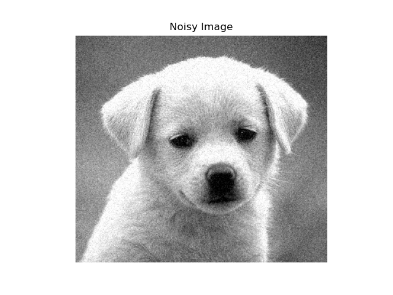
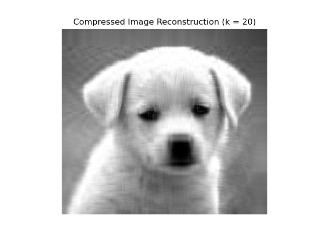
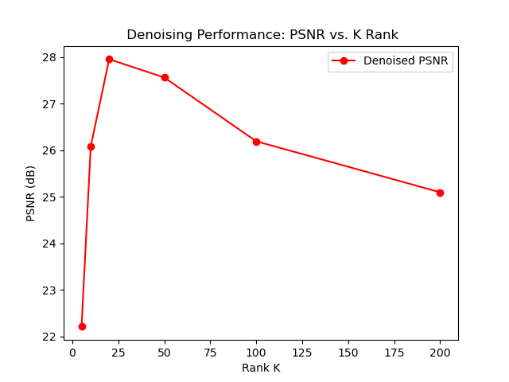
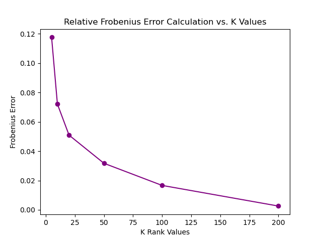

# Image Compression & Denoising via Singular Value Decomposition (SVD)

Implementation of low-rank matrix approximation using Singular Value Decomposition (SVD) for image compression and noise reduction.

---

## Overview
- **Low-Rank Approximation:** Matrix factorization ($A = U \Sigma V^T$) to extract principal singular vectors.
- **Image Compression:** Storage reduction and reconstruction accuracy evaluated via relative Frobenius error across $k \in \{5, 10, 20, 50, 100, 200\}$.
- **Image Denoising:** Filtering additive Gaussian noise and quantifying image fidelity via Peak Signal-to-Noise Ratio (PSNR).

---

## Visual Results

| Noisy Input | Denoised ($k=50$) | Compressed ($k=20$) |
| :---: | :---: | :---: |
|  |  |  |

### Quantitative Performance
| PSNR vs Rank ($k$) | Relative Frobenius Error vs Rank ($k$) |
| :---: | :---: |
|  |  |

---

## 🛠️ Installation & Run

1. Clone the repository:
```bash
git clone [https://github.com/](https://github.com/)<kullanici_adin>/image-compression-denoising-svd.git
cd image-compression-denoising-svd
